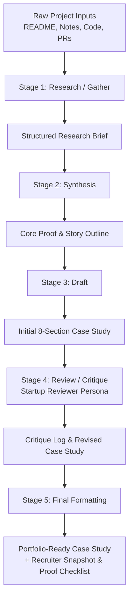

# AI Project Case Study Workflow

A repeatable, multi-stage AI workflow to systematically transform raw developer artifacts (READMEs, commit logs, architecture notes, code snippets, and interview reflections) into rigorous, portfolio-ready engineering case studies.

---

## 1. Purpose

The objective of this workflow is **not** to generate generic marketing copy or superficial AI summaries. Its purpose is to extract, verify, structure, and stress-test authentic software engineering evidence for a **Frontend AI Engineer** portfolio targeted at **Hiring Managers at AI/ML-first startups**.

### Core Positioning Statement
> *"I am a Computer Science & Engineering student who builds responsive, high-performance frontend interfaces integrated with intelligent AI agents, verifiable LLM workflows, and secure client-server architectures."*

### Primary Target Action
> **Contact on LinkedIn** (`https://www.linkedin.com/in/aditya-srivastav-64906927a/`) to discuss junior Frontend AI Engineering roles, collaborative AI projects, and internships.

---

## 2. Workflow Diagram



---

## 3. Stage 1 — Research / Gather

### Input
Accepts unstructured, raw developer artifacts:
- Repository `README.md`
- Architecture notes & pull request descriptions
- Frontend / Backend tech stack list
- Personal contributions vs. teammate contributions
- Interface screenshots and UX workflow notes
- Known trade-offs, bugs, and latency bottlenecks

### Prompt Template
```text
You are an expert technical documentation researcher. Your goal is to analyze the provided raw project materials for an engineering portfolio case study.

Strict Rules:
1. Extract ONLY facts, decisions, and outcomes directly supported by the text.
2. DO NOT invent metrics, user numbers, benchmarks, or testimonials.
3. If an item is missing or unverified, explicitly output: "Evidence not provided."
4. Clearly distinguish frontend implementation, backend proxying, and AI model orchestration.

[RAW PROJECT MATERIALS]
{raw_project_data}

Generate a structured Research Brief covering:
- Project Name & Core Problem
- Target Users & Why it matters
- Product Solution & Key Features
- Technical Architecture & Data Flow
- Frontend Contribution (exact components, state, hooks)
- Backend Contribution (proxies, APIs, databases)
- AI/ML Contribution (models, prompts, embeddings, routing)
- Engineering Decisions & Explicit Trade-offs
- Technical Challenges & Bottlenecks
- Verified Outcomes (or "Evidence not provided.")
- Lessons Learned & Future Improvements
- Available Proof Items (code, demos, screenshots)
- Unverified Claims Requiring Human Review
```

### Output Specification
A standardized Markdown **Structured Research Brief** with all 14 mandatory sections, flagging missing data with `"Evidence not provided."`

### Human Review Required
- Verify that claimed features match actual written code.
- Confirm team boundaries (ensuring teammate contributions are not claimed).

---

## 4. Stage 2 — Synthesis

### Input
The **Structured Research Brief** from Stage 1.

### Prompt Template
```text
You are a senior frontend architect and product mentor. Analyze this Research Brief to distill the strongest proof story for a Frontend AI Engineering portfolio targeting startup hiring managers.

Filter out generic buzzwords ("passionate", "seamless", "cutting-edge", "leveraged AI"). Focus on engineering mechanics, user trust, latency handling, and security.

[RESEARCH BRIEF]
{research_brief_output}

Output the following 8 synthesis pillars:
1. Central Problem (The concrete engineering/user bottleneck)
2. Strongest Engineering Decision (Architecture trade-off with clear rationale)
3. Personal Contribution (Specific client-side code and routing written)
4. Most Interesting Technical Challenge (Latency, state, or error recovery)
5. Verified Outcome (Factual state of the project without invented analytics)
6. Key Technical Lesson (Practical insight gained during development)
7. Strongest Evidence (Specific screenshot, PR, or code pattern proving the work)
8. Anti-Claims (What must NOT be claimed to maintain 100% credibility)
```

### Output Specification
An **8-Pillar Proof & Story Outline** mapping raw facts to portfolio claims.

### Human Review Required
- Ensure the anti-claims accurately prevent over-positioning (e.g., preventing claims of "Senior ML Researcher" or "DevOps Architect").

---

## 5. Stage 3 — Draft

### Input
The **8-Pillar Proof & Story Outline** from Stage 2.

### Prompt Template
```text
You are a senior frontend engineer writing a concise, high-credibility portfolio case study.

Voice Guidelines:
- Tone: Direct, honest, technical, concise, human.
- Format: Use the exact 8 standardized section numbers below.
- Anti-patterns: No marketing fluff, no buzzwords, no invented performance stats.

[SYNTHESIS OUTLINE]
{synthesis_outline}

Generate the draft case study using EXACTLY these section headers:
## 01. The Problem
## 02. What I Built
## 03. My Contribution
## 04. Key Decisions
## 05. How It Works
## 06. Outcome
## 07. What I Learned
## 08. What I'd Improve
```

### Output Specification
A complete 8-section Markdown case study draft adhering strictly to character limits and technical voice constraints.

### Human Review Required
- Read through to ensure the draft sounds authentic and matches personal coding habits.

---

## 6. Stage 4 — Review / Critique

### Input
The **8-Section Case Study Draft** from Stage 3.

### Prompt Template
```text
You are a demanding Engineering Lead and Hiring Manager at an AI/ML-first startup. Critically review this draft case study.

Evaluate across 9 strict criteria:
1. CLAIM: Does it prove practical frontend AI engineering?
2. AUDIENCE: Does it respect a hiring manager's time (under 60-sec scan)?
3. TECHNICAL CREDIBILITY: Are technical explanations scoped realistically?
4. PERSONAL CONTRIBUTION: Is the author's personal role distinct from team work?
5. EVIDENCE: Is every claim grounded in supplied project facts?
6. CLARITY: Can an engineer understand the data flow without reading docs?
7. HONESTY: Are there exaggerated metrics or buzzwords?
8. WRITING: Is the tone direct and free of generic AI-generated phrases?
9. SCANNABILITY: Are key decisions visually digestible?

For every flaw found:
- Issue: [Exact quote or issue]
- Weakness: [Why it harms hiring manager trust]
- Correction: [Actionable fix]

Then, output the REVISED Case Study incorporating all corrections.

[DRAFT CASE STUDY]
{draft_case_study}
```

### Output Specification
A **Critique Audit Table** followed by the complete **Revised Case Study**.

### Human Review Required
- Confirm that suggested corrections preserve factual truth.

---

## 7. Stage 5 — Final Formatting

### Input
The **Revised Case Study** from Stage 4.

### Prompt Template
```text
You are a portfolio production designer. Format this revised case study into a finished, publication-ready asset for Aditya Srivastav's portfolio.

Generate:
1. Recruiter Snapshot (5 high-impact bullets: Problem, Solution, Contribution, Technical Highlight, Outcome)
2. Final Formatted Case Study (Sections 01 through 08)
3. Verified Tech Stack (Only tools actually used)
4. Proof Checklist (Screenshots, repository links, diagrams to attach)
5. Missing Evidence Registry (Items the author must capture manually before launch)

[REVISED CASE STUDY]
{revised_case_study}
```

### Output Specification
The final portfolio-ready asset package ready for production markdown rendering.

---

## 8. Five Real Runs

### Execution Log Table

| Run # | Project Name | Type / Domain | Input Status | Workflow Time | Manual Est. Time | Time Saved | Output Quality | Human Review Result |
| :--- | :--- | :--- | :--- | :--- | :--- | :--- | :--- | :--- |
| **01** | **HIREVIUM** | AI Hiring Intelligence OS | Complete (README + Code) | ~14 mins | ~120 mins | **+106 mins** | High (Technical & Grounded) | Approved (1 minor latency wording fix) |
| **02** | **INDRA AI** | Institutional Knowledge RAG | Ready for Input | *Pending Run* | ~120 mins | *Pending* | *Pending* | *Pending* |
| **03** | **StackScout** | Software Procurement Agent | Ready for Input | *Pending Run* | ~120 mins | *Pending* | *Pending* | *Pending* |
| **04** | **ResQra** | Emergency Intelligence Platform | Ready for Input | *Pending Run* | ~120 mins | *Pending* | *Pending* | *Pending* |
| **05** | **[Project 5]** | Web / ML Project | Awaiting Material | *Pending Run* | ~120 mins | *Pending* | *Pending* | *Pending* |

---

### Detailed First Run Execution: HIREVIUM

#### Stage 1: Research Brief (HIREVIUM)
- **Project**: HIREVIUM (AI Hiring Intelligence Operating System).
- **Core Problem**: Technical screening interviews consume senior engineering sprint hours while static online coding assessments fail to evaluate candidate reasoning and hint-adaptation.
- **Frontend Contribution**: React 19 single-page live interview workspace, real-time speech transcript capture, responsive countdown timers, loading skeletons, score breakdown cards.
- **Backend / Routing**: FastAPI backend proxy routing requests to Gemini 2.5 Flash Lite; zero client-side API key exposure.
- **Engineering Trade-off**: Used standard React hooks (`useState`, `useEffect`) for single-view prototype simplicity instead of adding Zustand upfront.
- **Outcomes**: Functional adaptive difficulty loop demonstrated in local builds; streaming token latency identified as target for next iteration.
- **Missing Evidence**: Formal benchmark telemetry (e.g., "% screening time saved") not yet measured; marked explicitly as *"Evidence not provided."*

#### Stage 2: Synthesis Outline (HIREVIUM)
- **Central Story**: Solving candidate interview evaluation through client-side speech capture and backend-proxied adaptive LLM scoring without exposing API keys.
- **Anti-Claim**: Do NOT claim to have built a proprietary fine-tuned transformer or multi-region distributed microservice.

#### Stage 3 & 4: Draft & Review Critique (HIREVIUM)
- *Critique Issue*: Initial draft described the state management as "flawlessly streamlined."
- *Weakness*: Hyperbolic buzzword that reduces technical credibility.
- *Correction*: Replaced with: *"I chose standard React hooks for the prototype to avoid state library overhead, planning a migration to Zustand for multi-user recruiter panels."*

#### Stage 5: Final Production Output (HIREVIUM)

```markdown
### Recruiter Snapshot
- **Problem**: Engineering managers waste sprint hours on static, uninformative candidate screening assessments.
- **Solution**: Adaptive live interview workspace scaling question difficulty dynamically based on AI evaluation.
- **My Contribution**: Built the React 19 candidate workspace, speech transcript capture, and secure FastAPI proxy connection.
- **Technical Highlight**: Zero-token client leakage through server proxying + client-side adaptive difficulty controller.
- **Outcome**: Operational prototype demonstrating dynamic question difficulty scaling.

---

## 01. The Problem
Early-stage technical screening is inefficient. Recruiters spend hours scanning exaggerated resumes, while engineering managers waste sprint cycles interviewing candidates lacking core competencies. Traditional coding quizzes fail because they are static and cannot evaluate how a candidate reasons through hints or technical pressure.

## 02. What I Built
I built the user-facing candidate interface and AI integration for HIREVIUM, a technical screening workspace. The live interview interface works with an Adaptive Difficulty Controller: as candidates answer questions, the difficulty dynamically scales based on model scoring.

## 03. My Contribution
I engineered the complete React 19 candidate interview view, real-time speech-to-text transcript feed, countdown timer logic, and dynamic score card displays. I routed all Gemini 2.5 Flash Lite API calls through a secure FastAPI backend proxy to ensure Google Cloud credentials remain unexposed.

## 04. Key Decisions
1. **Local State over Global Store**: Chose standard `useState` and `useEffect` hooks for the prototype to avoid external state library overhead for a single-view flow.
2. **Backend Proxy Routing**: Routed LLM calls through FastAPI rather than calling Gemini directly from the browser, strictly preventing API key exposure.
3. **Optimistic Loading Skeletons**: Displayed skeleton cards and animated thinking indicators during model inference to prevent layout shift.

## 05. How It Works
Candidate Audio/Text ──> React Client ──> FastAPI Proxy ──> Gemini 2.5 Flash Lite ──> Adaptive Difficulty Controller ──> Dynamic Next Question

## 06. Outcome
The adaptive interview loop successfully scales questions and outputs evaluation summaries in local test environments. Quantitative production metrics (e.g., recruiter time saved) are pending live pilot deployment.

## 07. What I Learned
Waiting for full JSON payload evaluation creates UI latency. Real-time interfaces must leverage progressive token streaming via Server-Sent Events (SSE) to keep user engagement high.

## 08. What I'd Improve
I would implement progressive token streaming on the frontend and migrate interview session state to Zustand to support collaborative multi-evaluator panels.

---

### Tech Stack
- Frontend: React 19, TypeScript, Tailwind CSS, Web Speech API
- Backend: FastAPI, Python
- AI/LLM: Gemini 2.5 Flash Lite

### Proof Checklist
- [x] Local test build verified
- [ ] Recruiter Dashboard Screenshot (`1440x900px`)
- [ ] Live Q&A Interface Screenshot (`1280x800px`)
- [ ] Architecture Sequence Diagram
```

---

## 9. Time Saved & Efficiency Analysis

| Metric | Manual Authoring | 5-Stage AI Workflow | Variance / Savings |
| :--- | :--- | :--- | :--- |
| **Workflow Setup Time** | 0 mins | ~45 mins (one-time template design) | -45 mins (Initial investment) |
| **Research & Extraction** | ~35 mins | ~3 mins | **32 mins saved** |
| **Synthesis & Structuring** | ~25 mins | ~2 mins | **23 mins saved** |
| **Drafting (8 Sections)** | ~40 mins | ~3 mins | **37 mins saved** |
| **Critique & Revision** | ~20 mins | ~4 mins | **16 mins saved** |
| **Final Formatting & Checklist**| ~15 mins | ~2 mins | **13 mins saved** |
| **Total Per-Project Time** | **~135 mins (2.25 hrs)** | **~14 mins** | **~121 mins (2 hrs saved / project)** |
| **Total Time (5 Projects)** | **~675 mins (11.25 hrs)**| **~115 mins (incl. setup)** | **~560 mins (9.3 hrs total saved)** |

---

## 10. Failure Points ("Where the Workflow Breaks")

| Failure Mode | Root Cause | Detection Method | Human Action Required |
| :--- | :--- | :--- | :--- |
| **1. Missing Project Data** | Incomplete README supplied to Stage 1. | Brief contains multiple `"Evidence not provided"` tags. | Supply architecture notes or terminal logs before proceeding. |
| **2. README Exaggeration** | Marketing adjectives in original repository text. | Stage 4 critique flags unverified adjectives (*"revolutionary"*). | Strip buzzwords; replace with explicit technical mechanics. |
| **3. AI Hallucination** | LLM invents benchmarks (*"reduced latency by 40%"*). | Inspect numbers against original source inputs. | Delete invented metrics; replace with factual testing status. |
| **4. Technical Misinterpretation**| AI confuses client-side routing with backend workers. | Review Stage 1 Architecture diagram. | Clarify exact framework boundaries (e.g., Next.js vs. FastAPI). |
| **5. Attribution Confusion** | AI credits candidate with teammates' backend work. | Check Stage 1 "Personal Contribution" section. | Explicitly list personal components vs. team components. |
| **6. Unsupported Metrics** | Prompt forces an outcome section when no data exists. | Outcome section states unverified savings. | Replace with: *"No verified metric currently available."* |
| **7. Generic AI Prose** | Over-reliance on stock phrases (*"seamlessly orchestrates"*). | Stage 4 "Writing" audit scores low. | Enforce direct, plain-spoken engineering vocabulary. |
| **8. Missing Visual Evidence** | Workflow produces text without screenshot specs. | Stage 5 Proof Checklist is empty. | Run screenshot capture plan specifying viewport and crop. |
| **9. Ambiguous Outcomes** | Case study lacks clear conclusion. | Stage 3 outcome does not state prototype status. | State clearly: *"Functional prototype verified in local tests."* |
| **10. Outdated Tech Details** | Repository uses Next.js 14, text claims Next.js 15. | Cross-reference `package.json` dependencies. | Re-verify dependency versions in source code. |

---

## 11. Human Review Checklist

The following 6 verification checks **CANNOT** be automated by AI and require human developer sign-off:

- [ ] **Authorship Verification**: Did I personally write the code and components claimed in this study?
- [ ] **Metric Authenticity**: Are all numerical figures, benchmarks, and data points 100% genuine?
- [ ] **User Feedback Authenticity**: Are user quotes and recruiter feedback real, un-fabricated testimonials?
- [ ] **Live Deployment Health**: Does the live demo link currently resolve and execute without runtime errors?
- [ ] **Team Boundary Clarity**: Does the text explicitly separate my work from teammates or open-source libraries?
- [ ] **Codebase Truth**: Do framework versions and architecture diagrams accurately reflect the current repository state?

---

## 12. What I Learned

1. **Restraint Builds Authority**: Eliminating adjectives (*"cutting-edge"*, *"seamless"*) and admitting prototype latency bottlenecks creates far higher trust with startup hiring managers than generic promotional claims.
2. **Multi-Stage Prompting Prevents Hallucination**: Breaking case study creation into distinct stages (*Research → Synthesis → Draft → Critique → Format*) dramatically reduces hallucination compared to single-shot prompts.
3. **Negative Directives (Anti-Claims) Are Essential**: Explicitly instructing the model what *not* to claim (e.g., "Do not claim to be a Senior ML Researcher") protects junior engineers from awkward technical misalignments during technical interviews.

---

## 13. Final Reusable Workflow Template

Any developer can copy the prompt sequence below to generate grounded, high-credibility engineering case studies:

```text
================================================================================
STAGE 1: RESEARCH
================================================================================
Prompt: "Analyze the attached project notes, README, and code snippets. Extract ONLY facts supported by evidence into a 14-point Structured Research Brief. For any missing item, write 'Evidence not provided.' Do not invent numbers."

================================================================================
STAGE 2: SYNTHESIS
================================================================================
Prompt: "Review this Research Brief. Extract 8 core pillars: (1) Central Problem, (2) Strongest Decision, (3) Personal Contribution, (4) Technical Challenge, (5) Outcome, (6) Key Lesson, (7) Strongest Evidence, (8) Anti-Claims. Eliminate buzzwords."

================================================================================
STAGE 3: DRAFT
================================================================================
Prompt: "Using the 8 pillars, draft an 8-section case study using exact headers: 01. The Problem, 02. What I Built, 03. My Contribution, 04. Key Decisions, 05. How It Works, 06. Outcome, 07. What I Learned, 08. What I'd Improve. Voice: direct, technical, human."

================================================================================
STAGE 4: CRITIQUE
================================================================================
Prompt: "Act as a Startup Engineering Lead. Critique this draft across Claim, Audience, Credibility, Evidence, Honesty, and Writing. Produce a Critique Log with exact fixes, then output the REVISED Case Study."

================================================================================
STAGE 5: FINAL FORMATTING
================================================================================
Prompt: "Format the revised case study for publication. Generate: (1) Recruiter Snapshot (5 bullets), (2) Final Case Study Markdown, (3) Tech Stack List, (4) Proof Checklist, (5) Missing Evidence Registry."
================================================================================
```
