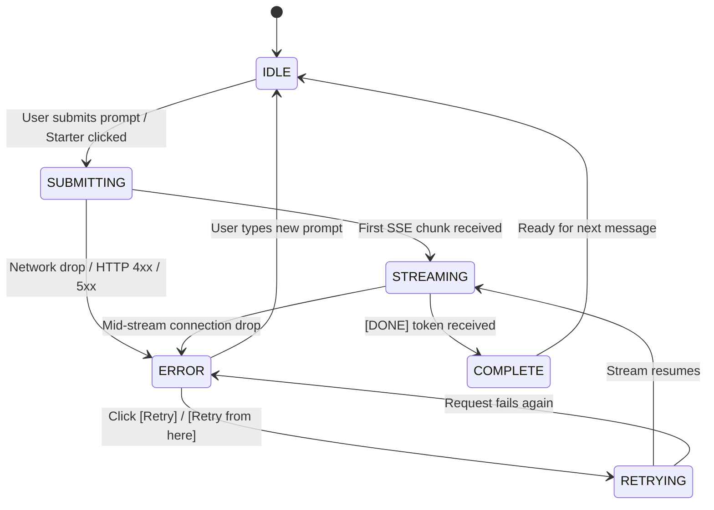

# HIREVIUM AI Interaction: Failure & Edge Case Handling Guide

This document outlines the architectural resilience, failure handling mechanisms, retry state machine, and edge-case behaviors implemented in **HIREVIUM — AI Hiring Intelligence Operating System**.

---

## 1. Primary AI Flow

```
[Candidate / User Input]
         │
         ▼
[Client Validation (Empty / Whitespace Guard)]
         │
         ▼
[HTTP POST /api/chat (Next.js Edge/Node API Route)]
         │
         ├─── (Network Failure / Offline) ──────────► [ChatErrorBanner (Network Retry)]
         ├─── (HTTP 429 Rate Limit) ────────────────► [ChatErrorBanner (Countdown Timer)]
         ├─── (HTTP 500 / 502 / 503 Server Error) ──► [ChatErrorBanner (Direct Retry)]
         │
         ▼
[Anthropic Claude 3.5 Sonnet / Vercel AI SDK Core Stream]
         │
         ├─── (Mid-Stream Connection Drop) ─────────► [Partial Text Retained + Interrupted Badge + Retry]
         ├─── (Empty Response / 0 Tokens) ──────────► [No Result Fallback Box + Action Buttons]
         │
         ▼
[Generative UI / Typed Tool Stream & Markdown Renderer]
         │
         ▼
[Complete Assistant Response]
```

---

## 2. Failure Cases Handled

| ID | Edge Case | Trigger / Condition | UI Presentation | Recovery Mechanism |
|:---|:---|:---|:---|:---|
| **01** | **Network Failure (Pre-Send)** | `navigator.onLine === false` or fetch connection drop | Amber alert banner: *"Unable to connect. Check your internet connection."* | Preserves user message in input/history; single-click `[Retry Connection]` re-triggers request upon reconnection. |
| **02** | **API / Server Error** | HTTP 500, 502, 503 from backend or AI provider outage | Red alert banner: *"Server encountered an error while generating response."* | `[Retry]` action resends the exact failed prompt without creating duplicate history entries. |
| **03** | **Mid-Stream Interruption** | Network drop or stream truncation mid-generation | Retains all received partial text + amber badge *"Response interrupted mid-stream"* | Inline `[Retry from here]` button seamlessly re-requests the generation while preserving context. |
| **04** | **Rate Limiting (HTTP 429)** | Provider throttle / concurrency limit exceeded | Warning banner: *"AI service is temporarily busy."* with live seconds countdown | Automated cooldown lock prevents rapid spam clicking; retry enables once cooldown expires. |
| **05** | **Empty / Blank Input** | Submitting empty string or whitespace-only message | Input remains focused; Send button disabled; accessible visual/ARIA tooltip displayed | Prevents redundant network calls; keeps candidate in flow. |
| **06** | **Empty / No Result Response** | AI generates zero tokens and no tool calls | Structured card: *"I couldn't generate a useful answer this time."* | Offers single-click `[Try Again]` and quick-prompt suggestions. |
| **07** | **First-Run Empty State** | Conversation history is empty on initial load | High-engagement hero card with 4 interactive starter prompts | Clicking any starter prompt directly populates and launches the technical interview. |
| **08** | **Slow Response / High Latency** | AI time-to-first-token > 2.5 seconds | Smooth `ThinkingIndicator` with dynamic phase labels (*"Connecting..."* → *"Analyzing job profile..."*) | User can monitor progress or click `[Stop]` at any moment to cancel. |
| **09** | **Rapid Double-Click / Race Condition** | User rapidly clicks Submit or Retry | Debounce guards & state-locked button disabled attributes during `submitting`/`streaming` | Explicit state machine transitions prevent stuck UI states. |
| **10** | **Mobile / Responsive Layout** | 375px to 1280px viewports, virtual keyboards | Dynamic `100dvh` layout, auto-resizing textareas, sticky header & pinned input dock | Floating `[Jump to Latest]` button appears when scrolling up during streaming. |

---

## 3. UI Presentation Details

### A. Non-Destructive Partial Stream Preservation
When a stream drops mid-sentence, standard chatbots discard the entire message. HIREVIUM retains every token received so the candidate can read what was evaluated, accompanied by an inline warning and localized retry control:
- **Badge**: `Response Interrupted` (amber pill).
- **Inline Action**: `[Retry from here]` button attached to the assistant bubble.

### B. Rate Limit Cooldown Protection
Upon receiving HTTP 429, the system parses the `Retry-After` header (or defaults to a graceful backoff) and displays an active countdown (`Retry available in 4s...`). The `[Retry]` button is disabled until the timer elapses.

### C. First-Run Hero Cards
Instead of an empty blank screen, candidates see an interactive onboarding panel with 4 tailored prompts:
1. *"Start a senior frontend technical interview on React architecture and streaming performance."*
2. *"Run an evaluation on my technical skills for a Staff Frontend Engineer role."*
3. *"Ask me 3 challenging questions about state management and race conditions in modern web apps."*
4. *"Simulate a system design interview for a real-time collaborative dashboard."*

---

## 4. Retry State Machine

The conversation lifecycle follows a deterministic finite state machine (FSM):



### Key Guarantees:
- **No Duplicate Messages**: Retrying replaces the failed placeholder rather than appending duplicate candidate messages.
- **Input Unlocking**: The textarea is immediately re-enabled upon entering `ERROR` state, allowing the candidate to either retry or formulate a new question.
- **Cancel Safety**: Clicking `[Stop]` cleanly transitions from `STREAMING` to `IDLE` with existing tokens preserved.

---

## 5. Mobile & Viewport Optimization

- **`100dvh` Viewport Sizing**: Avoids mobile Safari bottom address bar overlapping the chat input.
- **Pinned Bottom Input**: Input dock remains anchored with high z-index and subtle frosted backdrop blur (`backdrop-blur-md`).
- **Touch Targets**: All buttons adhere to minimum 44px touch targets.
- **Smart Auto-Scroll**:
  - Automatically scrolls down while user is at the bottom.
  - Automatically pauses auto-scroll if user scrolls up to review prior answers.
  - Renders a floating `Jump to latest` pill when new tokens stream while scrolled up.

---

## 6. How Failures Were Tested (Dev Sabotage Drawer)

A developer testing drawer (`DevSabotageDrawer.tsx`) is built into the interview interface for 1-click regression testing across all failure modes:

| Test Mode | Simulation Trigger | Verification Result |
|:---|:---|:---|
| **1. Network Offline** | Disconnect network or trigger pre-send rejection | Verified: Amber offline banner appears with single-click recovery. |
| **2. HTTP 500 Error** | Send `[SIMULATE:HTTP_500]` | Verified: Server error banner with non-destructive `[Retry]` button. |
| **3. HTTP 429 Rate Limit** | Send `[SIMULATE:HTTP_429]` | Verified: Cooldown message with dynamic countdown timer preventing spam. |
| **4. Mid-Stream Interruption** | Send `[SIMULATE:MID_STREAM_FAIL]` | Verified: Partial text preserved + `[Response Interrupted]` badge + inline retry. |
| **5. Empty Response** | Send `[SIMULATE:EMPTY_RESPONSE]` | Verified: Fallback card with suggested next steps. |
| **6. Slow Response** | Send `[SIMULATE:SLOW_RESPONSE]` | Verified: Progressive thinking indicator with status labels and responsive cancel. |
| **7. Empty Input Validation** | Click Send on empty textarea | Verified: Blocked at client layer with zero network calls. |
| **8. Mobile Viewport** | Chrome DevTools 375x812 iPhone simulation | Verified: Zero horizontal overflow; input anchored; touch targets accessible. |

---

## 7. Known Limitations & Production Recommendations

1. **Client-Side Storage**: Active conversation state is stored in React memory. In production, connect chat history to Supabase/Postgres with local IndexedDB offline caching.
2. **Exponential Backoff**: Currently uses fixed countdown timers for HTTP 429; in production, pair with jittered exponential backoff for high-load clusters.
