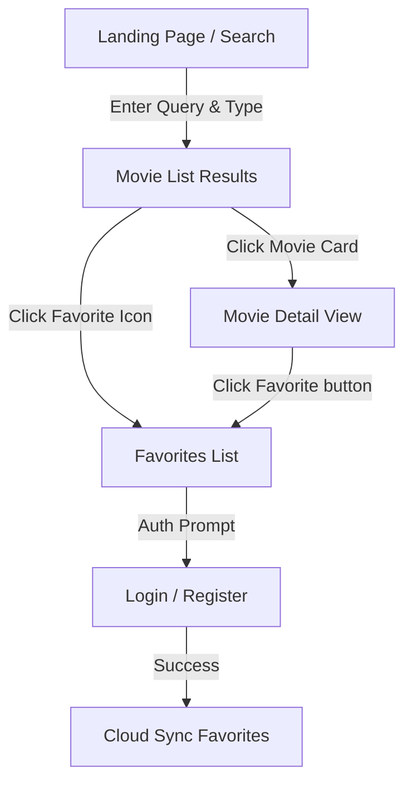

# Project Specification: FlyRank Movie Search & Catalog App (CineTrack)

This document establishes the architecture, functional requirements, and design specification for the **FlyRank Movie Search & Catalog Application** (CineTrack). This is a professional React application built with Next.js 15, React 19, TypeScript, Tailwind CSS, OMDb API, and Firebase (Auth & Realtime Database).

---

## 1. Application Purpose & Target User

### Purpose
CineTrack is an interactive movie discovery and cataloging platform. It allows users to search for movies, series, or episodes using the real-world OMDb API, view comprehensive details, manage a list of favorites, and synchronize their favorites database to the cloud via Firebase.

### Target User
Movie enthusiasts who want a clean, responsive, and fast dashboard to search, discover, and keep a personal watchlist of their favorite films and TV shows.

---

## 2. Core User Flow



1. **Discovery**: The user enters a search term (e.g., "Batman") and filters by type (Movie, Series, Episode).
2. **Details**: The user clicks on any movie card to navigate to a dedicated detail page displaying detailed plot, cast, ratings, and runtime.
3. **Save**: The user toggles a movie as a "Favorite", which stores it locally (localStorage) and syncs to Firebase if authenticated.
4. **Authentication**: The user logs in or registers to sync their favorites across multiple devices.

---

## 3. Page & Route Architecture (Next.js App Router)

*   **Home Page (`/`)**: Main search hub, featuring popular categories, an interactive search input, type filters, and a responsive results grid.
*   **Movie Detail Page (`/movies/[id]`)**: High-fidelity detail page highlighting movie media metadata, runtime, casting lists, and critic ratings.
*   **Favourites Page (`/favourites`)**: Personal list of saved titles, displaying quick cards with single-click removal.
*   **Auth Page (`/login` & `/register`)**: Clean authentication panels linking to Firebase Auth.

---

## 4. MVVM Architecture

We strictly separate concern layers to demonstrate premium software engineering patterns:

```text
+---------------------------------------+
|                View                   |  <-- App Router Pages & UI Components
|  (Renders JSX & consumes ViewModels)  |
+---------------------------------------+
                   |
                   v
+---------------------------------------+
|              ViewModel                |  <-- Custom React Hooks (useHomeViewModel)
|  (Manages State, triggers actions)    |
+---------------------------------------+
                   |
                   v
+---------------------------------------+
|                Model                  |  <-- Business Logic & API Services
|  (Data fetching, validation, schemas) |
+---------------------------------------+
```

### File Layout
```text
src/
├── app/                        # App Router Pages
│   ├── page.tsx                # Home / Search View Wrapper
│   ├── movies/[id]/page.tsx    # Movie Details View Wrapper
│   ├── favourites/page.tsx     # Favourites View Wrapper
│   ├── login/page.tsx          # Login View Wrapper
│   └── register/page.tsx       # Register View Wrapper
├── features/                   # Feature Folders (MVVM)
│   ├── home/
│   │   ├── HomeModel.ts
│   │   ├── useHomeViewModel.ts
│   │   └── HomeView.tsx
│   ├── details/
│   │   ├── MovieDetailModel.ts
│   │   ├── useMovieDetailViewModel.ts
│   │   └── MovieDetailView.tsx
│   ├── favourites/
│   │   ├── FavouritesModel.ts
│   │   ├── useFavouritesViewModel.ts
│   │   └── FavouritesView.tsx
│   └── auth/
│       ├── AuthModel.ts
│       ├── useAuthViewModel.ts
│       └── AuthView.tsx
├── services/                   # Service Classes
│   ├── omdbMovieService.ts     # OMDb API fetching
│   └── firebaseService.ts      # Firebase Auth & Realtime Database sync
└── types/                      # TypeScript definitions
    └── movie.ts                # Movie, Details, Search types
```

---

## 5. Functional & Technical Requirements

### Movie Vetting & Search
*   Query validation: Search term must be at least 2 characters.
*   Filter by type: All, Movies, Series, Episodes.
*   Pagination: Support multi-page results using OMDb pagination parameters (`&page=`).
*   Detail fetching: Query OMDb with the IMDb ID (`&i=`) and include full plot (`&plot=full`).

### Favorites & Database Sync
*   **Hybrid State**: Favorites are stored in `localStorage` by default (for unauthenticated sessions).
*   **Firebase Integration**: Once authenticated via Firebase Auth, favorites sync to Firebase Realtime Database. On logout, local cache is preserved.

### UI & Styling
*   **Theme**: Modern, cinematic dark theme (deep space background, glassmorphism card layouts, indigo/violet accents).
*   **Loading States**: Smooth pulse skeleton loaders during searches and detail loading.
*   **Responsive**: Fluid responsive grids for mobile, tablet, and widescreen layouts.
*   **Accessibility (a11y)**: Proper ARIA roles, associated input labels, keyboard navigability (focus indicators).

---

## 6. Acceptance Criteria

1.  **Search Input**: Typing a search query and hitting enter or clicking Search initiates an API request and displays results.
2.  **Empty State**: Searching a term with 0 matches displays a clear, friendly "No movies found" illustration and message.
3.  **Detail Page**: Clicking a card opens `/movies/[id]`, displaying detailed posters, ratings, actors, and directors.
4.  **Add/Remove Favorites**: Clicking the star/heart toggles the item in the favorites list.
5.  **Authentication**: Users can register, login, logout, and see their synchronized favorites list in real-time.
6.  **Performance & Build**: Project compiles cleanly with no TypeScript warnings; production build succeeds.
