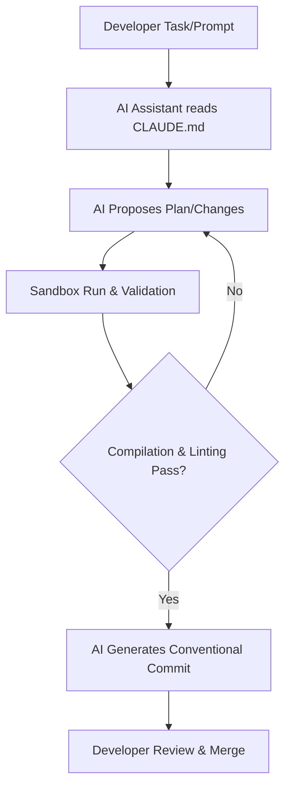

# FlyRank AI Frontend Engineering Capstone — Phase 1

Welcome to the **FlyRank AI Frontend Engineering Capstone Project**. This repository forms the architectural foundation for an AI-assisted, high-performance web application designed to demonstrate modern, premium frontend engineering practices.

---

## 1. Project Description
This repository serves as the core workspace for the capstone project. By integrating state-of-the-art developer tooling and modern React capabilities, the application delivers a premium, highly responsive user interface. This phase establishes our structural foundations, configuration settings, and AI alignment protocols.

## 2. Objectives
- Establish a clean, well-configured codebase tailored for **AI-assisted development**.
- Set up strict linting, styling, and structural patterns.
- Align code guidelines with modern React 19 standards and Next.js 15 App Router architecture.
- Build a structure ready for scalable component development.

## 3. Tech Stack
- **Runtime**: Node.js (LTS)
- **Framework**: Next.js 15 (App Router)
- **Library**: React 19
- **Language**: TypeScript
- **Styling**: Tailwind CSS
- **Command Line**: Claude Code / git
- **Editor**: VS Code

---

## 4. Project Structure
The repository is laid out according to professional standards:

```text
frontend-ai-capstone/
├── .vscode/               # Editor configurations
├── public/                # Static assets
├── src/
│   ├── app/               # App Router pages and CSS
│   │   ├── globals.css    # Global Tailwind styling
│   │   ├── layout.tsx     # Root layout wrapper
│   │   └── page.tsx       # Landing page entry point
├── .gitignore             # Git ignored files
├── CLAUDE.md              # AI styling & instruction rules
├── LICENSE                # MIT License
└── package.json           # Dependencies and workspace scripts
```

---

## 5. Getting Started

### Installation
Clone the repository and install the dependencies:
```bash
# Clone the repository
git clone https://github.com/your-username/frontend-ai-capstone.git

# Navigate to the workspace
cd frontend-ai-capstone

# Install packages
npm install
```

### Running the Project
Launch the local development server:
```bash
# Run local dev server
npm run dev
```
Open [http://localhost:3000](http://localhost:3000) in your browser to inspect the landing page.

---

## 6. Development & AI-Assisted Workflow

### AI-Assisted Development
This repository is pre-aligned with AI coding companions (such as Claude Code or Gemini). The development cycle follows a closed-loop system where AI agents work alongside engineers using the rules defined in [CLAUDE.md](file:///d:/Hackathon/frontend-ai-capstone/CLAUDE.md).

#### The AI-Developer Interaction Loop


#### AI Agent Command Cookbook
To assist AI models running commands directly, the following execution protocols are established:

| Phase | Goal | Command Pattern |
|---|---|---|
| **Inspection** | Inspect directory structure | `dir /s /b` (Windows CMD) or `Get-ChildItem -Recurse` (PowerShell) |
| **Development** | Spin up dev server | `npm run dev` |
| **Verification** | Run typescript and linter checks | `npm run lint` |
| **Commit** | Stage & commit changes | `git add . && git commit -m "type(scope): message"` |


### Git Workflow
We strictly adhere to the Conventional Commits specification to track progress and automate release cycles:
- `feat:` for new UI features or components
- `fix:` for fixing rendering or state errors
- `docs:` for modifying readmes, wikis, or inline documentation
- `style:` for adjusting styling without logic changes
- `chore:` for workspace maintenance or package upgrades

---

## 7. Future Roadmap
- **Phase 1 (Completed)**: Core repo architecture setup, AI workflow configuration, and basic page styling.
- **Phase 2 (Planned)**: Integration of shared global state, layout components, and dark-mode themes.
- **Phase 3 (Planned)**: High-fidelity dashboard views, external API integration, and performance benchmarking.

---

## 8. License
This project is licensed under the permissive MIT License. See the [LICENSE](file:///d:/Hackathon/frontend-ai-capstone/LICENSE) file for details.