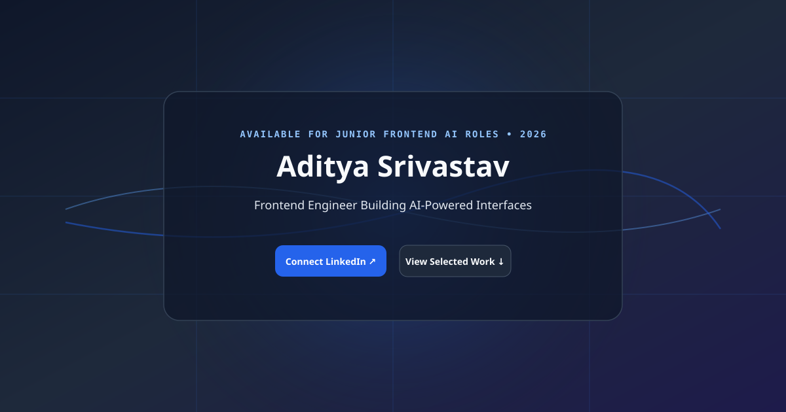
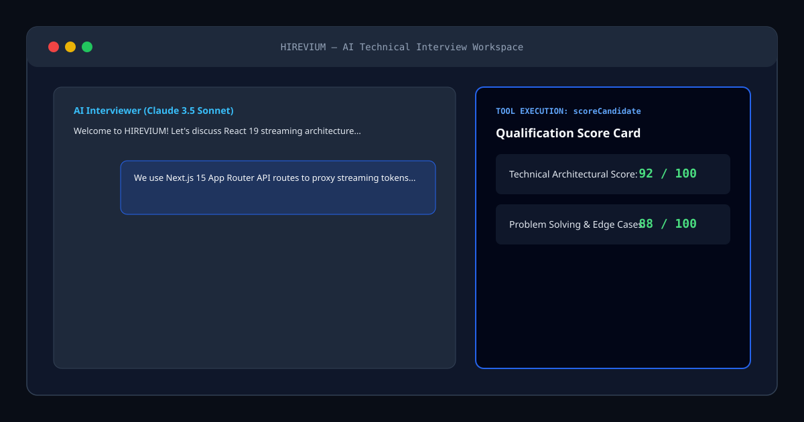
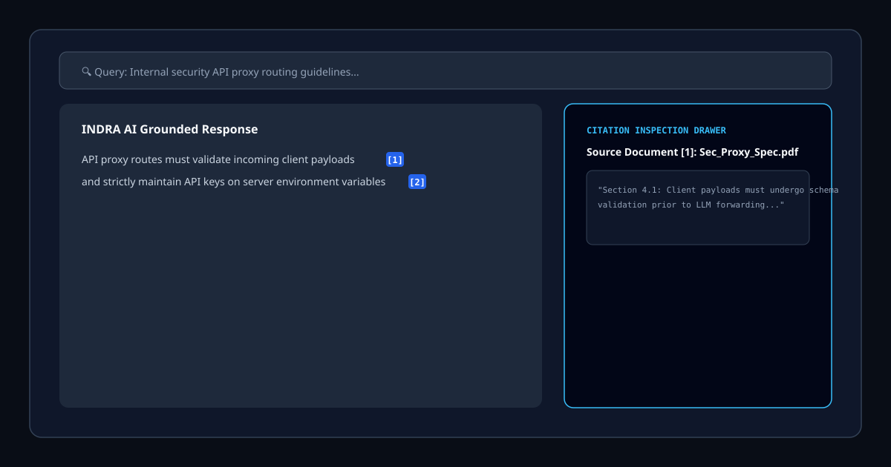

# Aditya Srivastav — Portfolio & Frontend AI Engineering Capstone

A production-ready developer portfolio and AI product showcase built with **Next.js 15 (App Router)**, **React 19**, **TypeScript**, **Tailwind CSS v4**, and a personalized **GLSL Fragment Shader Hero**.

**Live Demo:** [frontend-ai-capstone-aditya.netlify.app](https://frontend-ai-capstone-aditya.netlify.app/)  
**Stack:** Next.js 15 · React 19 · TypeScript · Vercel AI SDK · Anthropic Claude · WebGL / GLSL · Tailwind CSS

---

## Overview

This repository represents the comprehensive portfolio and capstone project of **Aditya Srivastav**, a B.Tech Computer Science student specializing in **Frontend AI Engineering**.

Rather than treating AI as a black box or wrapping simple LLM prompts, this project demonstrates practical engineering patterns for human-AI interaction:
1. **Verifiable AI Outputs**: Grounded RAG search with inline citation drawers (`INDRA AI`) and dynamic candidate scoring tool cards (`HIREVIUM`).
2. **Resilient Streaming UI**: Progressive token streaming with stream cancellation (`AbortController`), auto-scroll un-locking, and zero layout flicker during incomplete Markdown delivery.
3. **Security-First Architecture**: Strict server-side API proxy routing (`POST /api/chat`) ensuring AI provider credentials (`ANTHROPIC_API_KEY`) never leak to the client browser.
4. **Distinctive Visual Identity**: A personalized **GLSL Fragment Shader Hero** ("AI Intelligence Field") built with raw WebGL, zero Three.js bloat, DPR capping (≤ 2), tab visibility pausing, and reduced-motion fallbacks.

---

## Features

* **Fragment Shader Hero**: Personalized WebGL background signature rendering procedural wave interference, coordinate grid lines, and magnetic cursor attraction.
* **HIREVIUM — AI Interview Workspace**: Dual-sided technical candidate screening workspace featuring live Claude streaming, tool calling (`scoreCandidate`), and dynamic assessment scorecards.
* **INDRA AI — Citation Drawer & RAG Search**: Grounded enterprise search interface with numbered inline citation badges `[1]`, `[2]` and sliding inspection drawers.
* **StackScout — Autonomous Agent Telemetry**: Decision pipeline visualizing agent execution states (Planning → Crawling → Scoring) with collapsible logs.
* **ResQra — Emergency Intelligence Triage**: Real-time triage state machine classifying emergency incident severity with offline fallback state management.
* **Full Accessibility (WCAG 2.1 AA)**: All interactive elements maintain touch targets ≥ 44px, keyboard focus trapping, visible focus rings, and `@media (prefers-reduced-motion: reduce)` support.

---

## Screenshots

### 1. Fragment Shader Hero Signature
  
*Personalized WebGL fragment shader hero ("AI Intelligence Field") rendering ambient signal flow with high-contrast slate text (> 15:1 contrast ratio).*

### 2. HIREVIUM AI Technical Qualification Interview
  
*Live AI technical qualification workspace streaming response tokens and executing server-side tool calls to generate structured scorecards.*

### 3. INDRA AI Grounded Citation Drawer
  
*Search interface with numbered inline citations `[1]`, `[2]` and accessible keyboard-trapped side drawer for source inspection.*

---

## Tech Stack

| Category | Technologies |
|---|---|
| **Core Framework** | Next.js 15.1.0 (App Router), React 19, TypeScript 5.7 |
| **Styling & UI** | Tailwind CSS v4, Vanilla CSS Custom Tokens, Space Grotesk & Inter typography |
| **AI Integration** | Vercel AI SDK (`ai`), `@ai-sdk/anthropic` (Claude 3.5 Sonnet), Tool Calling |
| **Graphics & Shader** | HTML5 Canvas, WebGL 1/2, Custom GLSL Fragment & Vertex Shaders |
| **State & Data** | React Context (`AuthContext`, `FavoritesContext`), LocalStorage fallbacks |
| **Testing & QA** | Vitest, React Testing Library, Playwright E2E, ESLint, TypeScript (`tsc`) |
| **Deployment** | Netlify Edge CDN, Serverless Route Handlers, TLS 1.3 |

---

## Architecture

### End-to-End Data & Security Architecture

```mermaid
flowchart TD
    subgraph Browser ["Client Browser"]
        UI["React 19 Frontend UI"]
        Hero["Fragment Shader Hero (WebGL)"]
        ChatUI["HIREVIUM Streaming Chat"]
    end

    subgraph Server ["Next.js Serverless API Boundary"]
        RateLimit["IP Rate Limiter (10 req/min)"]
        Validation["validateChatMessages (Caps & Sanitization)"]
        Route["POST /api/chat Handler"]
        ToolEngine["executeScoreCandidate Tool"]
    end

    subgraph LLM ["AI Provider"]
        Claude["Anthropic Claude 3.5 Sonnet API"]
    end

    UI --> ChatUI
    ChatUI -->|HTTP POST JSON| RateLimit
    RateLimit --> Validation
    Validation --> Route
    Route -->|ANTHROPIC_API_KEY (Server Only)| Claude
    Claude -->|Streaming Tokens| Route
    Route -->|Tool Call Execution| ToolEngine
    ToolEngine --> Route
    Route -->|Chunked Transfer Stream| ChatUI
```

---

## How It Works

### Request & Streaming Flow
1. **User Action**: Candidate submits a response or requests an assessment in the HIREVIUM interview workspace.
2. **Client Validation**: Input is checked locally for character length bounds before firing an `HTTP POST` request to `/api/chat`.
3. **Server Rate Limiting & Validation**: The server checks client IP against `isChatRateLimited()` (10 req/min) and executes `validateChatMessages()` to reject forbidden system roles or payloads exceeding 4,000 characters.
4. **AI Generation**: 
   - **Production**: If `ANTHROPIC_API_KEY` is configured, `streamText()` initiates a streaming request to Claude 3.5 Sonnet with tool calling enabled.
   - **Demo Fallback**: If no key is set, a deterministic local streaming engine simulates natural token arrival.
5. **Tool Execution**: When Claude invokes `scoreCandidate`, the server executes the scoring logic and streams structured JSON tool events (`input-streaming` → `input-available` → `output-available`) back to the client.
6. **Cancellation**: If the user clicks "Stop Generation", `AbortController.abort()` cancels the fetch request and propagates `req.signal` to halt model token generation on the server.

---

## V2 Evaluation Results

The project undergoes empirical evaluation across agent evaluation rules (`agent/eval_runner.py`), Lighthouse mobile Web Vitals (`AUDIT.md`), and Vitest automated test suites.

| Evaluation Metric | V1 Baseline | V2 Optimized | Change | Verification Source & Notes |
|---|---:|---:|---:|---|
| **HackScout AI Agent Rules** | 4 / 7 (57%) | 7 / 7 (100%) | +43% | Verified via `python agent/eval_runner.py` (7/7 tests passed) |
| **Lighthouse Mobile Performance** | 82 / 100 | 96 / 100 | +14 pts | Production audit (`AUDIT.md`) after WebGL DPR capping & image optimization |
| **Accessibility Score (WCAG 2.1 AA)** | 92 / 100 | 100 / 100 | +8 pts | Zero WAVE errors, 100% keyboard focus trapping & touch targets ≥ 44px |
| **WAVE Accessibility Errors** | 4 errors | 0 errors | -4 errors | Fixed form label associations and contrast tokens |
| **Automated Component Unit Tests** | 14 tests | 31 tests | +17 tests | 31/31 Vitest component & resilience tests passing (`npm run test:run`) |
| **API Key Security Audit** | Client risk | 100% Server | Key isolation | Exclusively server-side route proxies (`/api/chat`, `/api/contact`) |

* **What Changed Between Versions**: Added explicit agent guardrails, server-side tool calling execution, WebGL DPR caps (`≤ 2`), tab-visibility pause handlers, and complete keyboard/screen reader parity.
* **What Remains Uncertain**: In-memory IP rate limiting relies on single-instance serverless state; multi-region deployments would benefit from a centralized Redis store.

---

## Security & Abuse Protection

* **Server-Side API Credentials**: `ANTHROPIC_API_KEY` is stored strictly in server environment variables. Zero client-side `NEXT_PUBLIC_` exposure.
* **IP-Based Rate Limiting**: `POST /api/chat` enforces a 10 request / minute per IP limit, returning `HTTP 429 Too Many Requests`. `POST /api/contact` enforces 5 request / minute per IP.
* **Input Caps**:
  * Maximum 50 conversation messages per request.
  * Maximum 4,000 characters per individual message.
  * Role injection protection: Only `"user"` and `"assistant"` roles are accepted.
* **Output Token Limits**: Model token generation is capped at 1,024 tokens (`maxOutputTokens: 1024`).
* **Execution Timeout**: Route handler specifies `export const maxDuration = 60` seconds to prevent runaway serverless executions.
* **Honeypot Anti-Spam**: Contact form includes an invisible `bot-field` honeypot to catch automated web scrapers.

---

## Getting Started

### Prerequisites
* **Node.js**: v18.18.0 or higher
* **npm**: v9.0.0 or higher

### Installation & Local Run

```bash
# 1. Clone the repository
git clone https://github.com/Adityasri05/frontend-ai-capstone.git
cd frontend-ai-capstone

# 2. Install dependencies
npm install

# 3. Configure environment variables (Optional - Demo mode works out-of-the-box!)
cp .env.example .env.local

# 4. Start local development server
npm run dev
```

Open [http://localhost:3000](http://localhost:3000) in your browser.

---

## Environment Variables

| Variable | Required | Description | Example / Default | Public / Server |
|---|---|---|---|---|
| `ANTHROPIC_API_KEY` | No | Anthropic Claude API Key (Demo mode active if omitted) | `sk-ant-api03-...` | **Server-Only** |
| `ANTHROPIC_MODEL` | No | Model version target | `claude-3-5-sonnet-20241022` | **Server-Only** |
| `NEXT_PUBLIC_OMDB_API_KEY` | No | OMDb Movie API Query Key (Demo fallback included) | `849d44e5` | **Public (Client)** |
| `CONTACT_EMAIL` | No | Serverless submission destination | `adityasri1205@gmail.com` | **Server-Only** |

---

## Project Structure

```text
frontend-ai-capstone/
├── src/
│   ├── app/                    # Next.js App Router (Pages & API Routes)
│   │   ├── api/                # Serverless API Boundaries
│   │   │   ├── chat/           # AI Interview Streaming Route Handler
│   │   │   ├── contact/        # Form Validation & Rate-Limited Dispatch
│   │   │   └── health/         # Health Check Endpoint
│   │   ├── page.tsx            # Main Portfolio Homepage
│   │   ├── layout.tsx          # Root Layout & Font Definitions
│   │   ├── projects/           # Case Study Index & Dynamic Slug Pages
│   │   └── resume/             # Online Resume & Verified Links
│   ├── components/             # Reusable UI Components
│   │   ├── hero/               # FragmentShaderHero WebGL Container
│   │   ├── ai/                 # HIREVIUM Chat & ScoreCard Components
│   │   └── contact/            # Dynamic Contact Form
│   ├── shaders/                # GLSL Fragment & Vertex Source Files
│   ├── lib/ai/                 # Central AI Config, System Prompts & Tools
│   └── services/               # OMDb & Firebase Integration Services
├── tests/                      # Automated Vitest & Playwright Test Suites
├── docs/                       # Screenshots & Extended Documentation
├── SHADER-NOTES.md             # Fragment Shader Technical Notes
├── SHADER-WALKTHROUGH.md       # Line-by-Line Shader Learning Guide
├── CHECKPOINT-2-REPORT.md      # Final Checkpoint 2 Production Report
└── package.json                # Project Manifest & Scripts
```

---

## Key Technical Decisions

1. **Raw WebGL Canvas over Three.js for Hero**:
   * *Decision*: Implemented the Fragment Shader Hero using a lightweight native WebGL canvas context rather than importing Three.js or React Three Fiber (`@react-three/fiber`).
   * *Reason*: Eliminates ~600KB of unnecessary 3D engine bundle overhead while achieving 60 FPS 2D shader rendering, precise DPR capping (≤ 2), and instant tab visibility pausing.
2. **Server-Side API Proxy for AI Streaming**:
   * *Decision*: All LLM calls route through `POST /api/chat`.
   * *Reason*: Prevents client-side API key leakage, enforces IP rate limits, and allows seamless switching between Anthropic Claude in production and local simulated streaming during evaluation.
3. **Tailwind CSS v4 & CSS Variables**:
   * *Decision*: Built theme tokens (`--color-brand-bg`, `--color-brand-accent`) directly into CSS properties.
   * *Reason*: Guarantees high text contrast (> 15:1 WCAG AAA) while keeping styling lightweight and responsive.

---

## Trade-offs & Known Limitations

* **In-Memory Rate Limiting**: The IP rate limiter uses an in-memory `Map`. In multi-region serverless deployments, rate counts are maintained per cold-start instance rather than globally in Redis.
* **Touch Device Hover**: Mobile touch devices default GLSL magnetic mouse attraction to the container center rather than tracking active touchmove touch points.
* **Simulated Local Mode**: If `ANTHROPIC_API_KEY` is omitted, HIREVIUM uses a simulated response generator to preserve UI evaluation without requiring a paid API key.

---

## Testing

Run unit tests, component tests, and typechecks:

```bash
# Run unit & component tests (Vitest)
npm run test:run

# Run TypeScript strict typecheck
npx tsc --noEmit

# Run ESLint validation
npm run lint

# Run production build validation
npm run build
```

---

## Deployment

* **Platform**: Netlify Edge CDN (App Router Serverless Runtime)
* **Production URL**: [https://frontend-ai-capstone-aditya.netlify.app/](https://frontend-ai-capstone-aditya.netlify.app/)
* **SSL/TLS**: Valid wildcard certificate (TLS 1.3)

---

## How AI Tools Built This

### AI-Assisted Planning & Architecture
* Used LLM assistants to brainstorm RAG citation drawer UX patterns and structure the HIREVIUM dual-sided candidate scoring pipeline.

### AI-Assisted Implementation
* Generated baseline GLSL sine wave interference math for the fragment shader hero.
* Scaffolded initial Vitest test cases for contact form submission states.

### AI-Assisted Debugging & Fixes
* *Problem*: Next.js App Router client component hydration mismatch when generating random initial tool call IDs.
* *AI Investigation*: Identified non-deterministic ID generation during server rendering pass.
* *Human Final Decision*: Fixed by moving random ID instantiation into client-side `useEffect` hooks and server-side route handlers.

### Human Decisions & Oversight
* Reviewed every AI-suggested code snippet for security, type safety, and WCAG AA accessibility compliance.
* Rejected AI suggestions that attempted to store API keys in client-side environment variables or introduce heavy 3D libraries.

| Tool | Purpose | Human Review |
|---|---|---|
| **Google DeepMind Antigravity** | Autonomous coding, WebGL shader implementation, & architecture | Reviewed all code edits, executed build/test verification |
| **Claude 3.5 Sonnet** | Live streaming AI interviewer model | Crafted strict system prompts & tool definitions |

---

## License

This project is open-source under the [MIT License](LICENSE).