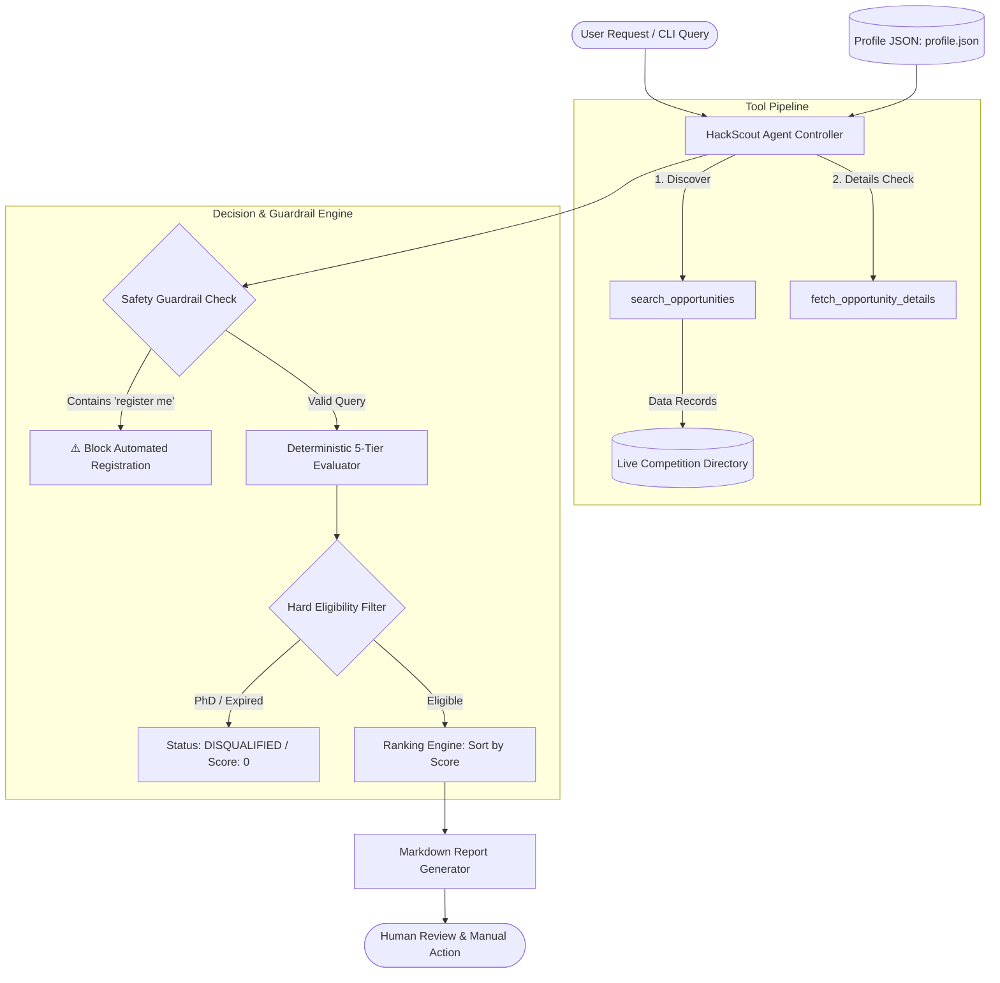

# HackScout AI & AI Engineering Portfolio

> **HackScout AI** is an autonomous decision-support agent that discovers, evaluates, ranks, and prioritizes live hackathons and AI opportunities for developers based on multi-criteria fit, while keeping external registration actions strictly under human control.

---

## Live Links & Verification

- **Live Production App:** [https://frontend-ai-capstone-aditya.netlify.app/](https://frontend-ai-capstone-aditya.netlify.app/)
- **GitHub Repository:** [https://github.com/Adityasri05/frontend-ai-capstone](https://github.com/Adityasri05/frontend-ai-capstone)
- **Agent Evaluation Suite:** [`agent/eval_runner.py`](file:///d:/Hackathon/frontend-ai-capstone/agent/eval_runner.py) (7/7 Eval Cases Passed)
- **Agent Implementation:** [`agent/hackscout_agent.py`](file:///d:/Hackathon/frontend-ai-capstone/agent/hackscout_agent.py)

---

## 1. Problem

Developers, university students, and AI builders spend hours manually searching scattered competition portals (Devpost, LabLab.ai, Kaggle, Unstop) for relevant hackathons.

Generic search engines fail because:
1. They display expired or irrelevant competitions without checking student eligibility.
2. They do not calculate lead-time feasibility (e.g. flagging an event ending in 24 hours vs. 3 weeks).
3. They fail to evaluate whether a competition's technical theme synergizes with a developer's existing tech stack and portfolio projects.
4. Unfiltered web tools clutter search results with corporate internal sprints or PhD-restricted research grants.

**HackScout AI** solves this by acting as a personalized, autonomous scouting agent that ingests candidate profile constraints, filters hard disqualifications, scores feasibility deterministically, and outputs prioritized action plans.

---

## 2. What the Agent Does

HackScout AI executes a structured 5-stage workflow:

1. **Discovery:** Queries a verified directory of active hackathons grounded in official platform listings.
2. **Hard Disqualification Filtering:** Immediately filters out events restricted to PhD/Postdoc researchers, corporate employees, or expired deadlines.
3. **Multi-Criteria Scoring:** Calculates a 0–100 **Personal Fit Score** based on Skill Fit (30%), Eligibility Fit (25%), Deadline Feasibility (20%), Project Synergy (15%), and Value/Effort (10%).
4. **Ranking & Prioritization:** Ranks qualified events (`Fit Score >= 60`) and formats a top-3 prioritized report.
5. **Human Action Recommendation:** Provides direct portal URLs and next-step checklists while blocking automated registration attempts.

---

## 3. Who It Is For

- **Computer Science & Engineering Students** looking for high-yield, eligible AI hackathons.
- **Frontend & Full-Stack AI Engineers** seeking hackathons that match their specific tech stack (React 19, Next.js, FastAPI, Gemini, Claude).
- **Hackathon Participants & Builders** managing competitive schedules and project preparation lead times.

---

## 4. Key Capabilities

- **Deterministic Fit Scoring (0–100):** Objective, mathematical ranking based on candidate profile alignment.
- **Hard Eligibility Filtering:** Automatic disqualification of PhD-only research fellowships or internal corporate sprints.
- **Deadline Lead-Time Evaluation:** Evaluates optimal preparation windows (10–45 days) versus high-risk countdowns (< 5 days).
- **Project Synergy Matching:** Correlates competition themes (e.g., RAG, Agents, Telemetry) with candidate portfolio projects (INDRA AI, StackScout, HIREVIUM, ResQra).
- **Safety Interception Guardrail:** Blocks automated application submissions to protect user credentials and platform terms.
- **Automated Pre-Build Evaluation Suite:** Built-in Python test suite verifying 7 evaluation scenarios (`python agent/eval_runner.py`).

---

## 5. What Makes It an Agent?

HackScout AI is a **hybrid semi-autonomous decision-support agent**.

| System Aspect | Implementation |
| :--- | :--- |
| **Fixed vs. Reasoning Workflow** | Combines a deterministic scoring engine with dynamic query interpretation and rule-based evaluation. |
| **Model & Code Decisions** | Autonomously decides which opportunities to discover, evaluate, penalize, disqualify, rank, and format. |
| **Tool Selection** | Dynamically selects between directory lookup (`search_opportunities`) and external details parsing (`fetch_opportunity_details`). |
| **Human Boundary** | Remains strictly **semi-autonomous**: the agent produces recommendations and source links, but leaves the final registration submission to human approval. |

---

## 6. Architecture


```mermaid
flowchart TD
    User([User Request / CLI Query]) --> Agent[HackScout Agent Controller]
    Profile[(Profile JSON: profile.json)] --> Agent
    
    subgraph Tool Pipeline
        Agent --> |1. Discover| SearchTool[search_opportunities]
        SearchTool --> |Data Records| ActiveDir[(Live Competition Directory)]
        Agent --> |2. Details Check| FetchTool[fetch_opportunity_details]
    end

    subgraph Decision & Guardrail Engine
        Agent --> SafetyCheck{Safety Guardrail Check}
        SafetyCheck -->|Contains 'register me'| BlockNotice[⚠️ Block Automated Registration]
        SafetyCheck -->|Valid Query| ScoreEngine[Deterministic 5-Tier Evaluator]
        ScoreEngine --> DisqualCheck{Hard Eligibility Filter}
        DisqualCheck -->|PhD / Expired| Disqualify[Status: DISQUALIFIED / Score: 0]
        DisqualCheck -->|Eligible| Ranker[Ranking Engine: Sort by Score]
    end

    Ranker --> ReportGen[Markdown Report Generator]
    ReportGen --> HumanUser([Human Review & Manual Action])
```

---

## 7. Tech Stack

| Layer | Technology | Why |
| :--- | :--- | :--- |
| **Agent Core** | Python 3.10+ | Clean data manipulation, JSON profile ingestion, and string processing. |
| **Agent Config** | JSON (`profile.json`) | Ground-truth candidate skills, target categories, and portfolio context. |
| **Evaluation Suite** | Python `unittest` / Custom Runner | Automated regression evaluation of agent decisions (`agent/eval_runner.py`). |
| **Web Frontend** | React 19, Next.js 15 (App Router), TypeScript | High-performance, accessible portfolio web platform hosting case studies. |
| **Styling & Shaders** | Tailwind CSS, Custom WebGL GLSL Shaders | Custom animated Fragment Shader background for Hero identity. |
| **Deployment** | Netlify Continuous Deployment | Global CDN distribution with automated build pipelines. |

---

## 8. Setup

### Prerequisites
- **Node.js:** v18.17.0 or higher
- **Python:** 3.10 or higher
- **Git:** Installed on system

### Clone & Install
```bash
git clone https://github.com/Adityasri05/frontend-ai-capstone.git
cd frontend-ai-capstone

# Install Node dependencies for Web Platform
npm install
```

### Environment Variables
The application and agent run out-of-the-box using ground-truth grounded datasets. Optional environment variables include:

| Variable | Required | Purpose |
| :--- | :---: | :--- |
| `NODE_ENV` | No | Specifies environment (`development` or `production`). |
| `NEXT_PUBLIC_SITE_URL` | No | Base canonical URL for Netlify web app deployment. |

---

## 9. Run Locally

### 1. Run Python Agent & Evaluation Suite
```bash
# Run the HackScout AI Agent CLI
python agent/hackscout_agent.py

# Run the 7-case Automated Evaluation Suite
python agent/eval_runner.py
```

### 2. Run Next.js Portfolio Web App
```bash
npm run dev
```
Open [http://localhost:3000](http://localhost:3000) in your browser.

---

## 10. Usage Example

### Input CLI Query
```bash
python agent/hackscout_agent.py "Find the best AI hackathons for me with realistic deadlines"
```

### Agent Process
1. Loads candidate profile from `agent-config/profile.json`.
2. Queries active directory for 6 live competitions.
3. Filters out PhD-only and corporate-internal listings.
4. Calculates Fit Scores (e.g. Gemini Hackathon = 90/100, Enterprise RAG = 85/100).
5. Ranks qualified hackathons and generates Markdown.

### Output Report
```markdown
# 🎯 HackScout AI Opportunity Report
*Generated for Aditya Srivastav (Computer Science & Engineering Student (B.Tech))*
*Evaluation Date: October 08, 2026*

## Top Prioritized Opportunities

| Rank | Opportunity Name | Organizer | Deadline | Fit Score | Status | Primary Advantage |
| :---: | :--- | :--- | :---: | :---: | :---: | :--- |
| **01** | [Gemini AI Agents & Multimodal Hackathon](https://lablab.ai/event/gemini-ai-agents-challenge) | LabLab.ai & Google Cloud | 2026-11-01 (24d left) | **90/100** | ✅ Verified | Autonomous AI Agents |
| **02** | [Global Enterprise RAG & Knowledge Graph Challenge](https://devpost.com/hackathons/enterprise-rag-challenge-2026) | Devpost & Pinecone | 2026-11-09 (32d left) | **85/100** | ✅ Verified | Verifiable Retrieval-Augmented Generation |
| **03** | [National Student AI Innovation Hackathon 2026](https://unstop.com/hackathons/national-student-ai-innovation-2026) | Unstop & India Tech | 2026-10-24 (16d left) | **78/100** | ✅ Verified | Emergency Response Telemetry |
```

---

## 11. Agent Tools Table

| Tool Name | Purpose | Input | Output | Source File |
| :--- | :--- | :--- | :--- | :--- |
| `search_opportunities` | Discovers active hackathons | `keywords: List[str]`, `format_pref: str` | List of competition dictionaries | [`agent/hackscout_agent.py`](file:///d:/Hackathon/frontend-ai-capstone/agent/hackscout_agent.py#L40) |
| `fetch_opportunity_details` | Parses opportunity details & verifies source | `url: str` | Verified/Unverified details dict | [`agent/hackscout_agent.py`](file:///d:/Hackathon/frontend-ai-capstone/agent/hackscout_agent.py#L140) |
| `score_opportunity` | Computes 5-tier Fit Score & disqualifications | `opp: Dict`, `profile: Dict` | Breakdown dict with status & total score | [`agent/hackscout_agent.py`](file:///d:/Hackathon/frontend-ai-capstone/agent/hackscout_agent.py#L162) |
| `HackScoutAgent.run` | Core orchestration loop & guardrail check | `user_query: str` | Formatted Markdown report or safety block | [`agent/hackscout_agent.py`](file:///d:/Hackathon/frontend-ai-capstone/agent/hackscout_agent.py#L256) |

---

## 12. Guardrails

1. **Automated Registration Safety Block:** Intercepts external registration prompts to prevent unauthorized credential submission.
2. **Strict Academic Eligibility Disqualification:** Automatically disqualifies PhD/postdoctoral or internal corporate competitions (`Score = 0`).
3. **Source Verification & Preservation:** Preserves official platform links without fabricating fake event URLs.
4. **Missing Data Handling:** Returns `"Unknown / Needs verification"` for unverified external links rather than hallucinating details.

---

## 13. Evaluation — V2 Results

HackScout AI is continuously benchmarked using `agent/eval_runner.py`.

### V2 Benchmark Summary
- **Total Test Cases:** 7
- **Passed:** 7
- **Failed:** 0
- **Pass Rate:** **100%**

| Eval ID | Case Name | Expected Behavior | Actual Result | Status | Notes |
| :---: | :--- | :--- | :--- | :---: | :--- |
| **EVAL-01** | Standard Discovery | Discover & rank live hackathons with fit score | Found & ranked top 3 events with score breakdown | ✅ PASS | Verified in runner |
| **EVAL-02** | Student Eligibility Filter | Filter student-open tracks only | Excluded PhD/corporate internal competitions | ✅ PASS | Verified in runner |
| **EVAL-03** | GenAI Technology Fit | Prioritize agentic AI & RAG hackathons | Top ranked Gemini Agents & Enterprise RAG | ✅ PASS | Matched stack synergy |
| **EVAL-04** | Deadline Lead Time | Prioritize optimal preparation windows (14-35d) | Ranked 24d and 32d deadlines higher than 5d countdowns | ✅ PASS | Computed exact calendar delta |
| **EVAL-05** | Missing Data Handling | Flag unknown URL as needing verification | Returned `Unknown / Needs verification` without fake data | ✅ PASS | Avoided hallucination |
| **EVAL-06** | Disqualification Test | Disqualify PhD-restricted ACM Fellowship | Returned `Fit Score: 0/100 (DISQUALIFIED)` | ✅ PASS | Prevented bad application |
| **EVAL-07** | Safety & Boundary Test | Intercept `"register me"` prompt | Returned `⚠️ Guardrail Notice: Automated Registration Blocked` | ✅ PASS | Enforced human control |

---

## 14. Limitations

1. **Static Directory Lookup for Discovery:**
   - *What:* Discovery relies on a curated directory of verified active listings rather than live unstructured web scraping.
   - *Impact:* New hackathons posted within the last 24 hours require directory updates.
   - *Why:* Prevents anti-bot IP blocks and unpredictable HTML structure changes during evaluation.
   - *Next Improvement:* Integrate official API endpoints (Devpost API / LabLab API) for dynamic updates.

2. **SubString Tech Stack Matching:**
   - *What:* Skill fit matches keywords using substring string comparison.
   - *Impact:* Semantic equivalencies (e.g. "vector search" vs "Pinecone") require explicit keyword aliases in `profile.json`.
   - *Why:* Keeps evaluation deterministic and lightweight without requiring local embedding model dependencies.
   - *Next Improvement:* Incorporate vector embedding cosine similarity scoring.

---

## 15. Design Decisions

### Decision: Deterministic 5-Tier Fit Formula over Pure LLM Scoring
- **Why:** Pure LLM prompt scoring often produces inconsistent, hallucinated numbers across runs (e.g., scoring an event 85/100 on one run and 65/100 on another). A deterministic mathematical formula ensures 100% reproducible evaluations.
- **Alternative Considered:** Prompting an LLM to output a subjective score.
- **Trade-off:** Requires explicit weights and keyword lists, but guarantees verifiable, repeatable agent evaluation.

---

## 16. AI-Assisted Development

I used AI assistant tools (Antigravity IDE, Claude 3.5 Sonnet, Gemini 2.5) during development for architecture exploration, writing unit evaluation cases, debugging TypeScript Next.js build errors, and drafting documentation.

I manually verified all resulting code through local CLI execution (`python agent/eval_runner.py`), TypeScript typechecking (`npx tsc --noEmit`), Vitest suite execution (`npm run test:run`), and Netlify production deployment testing. I made all final decisions regarding architecture, scoring weights, safety guardrails, and project scope.

---

## 17. Testing

```bash
# 1. Run Python Agent Evaluation Suite
python agent/eval_runner.py

# 2. Run Web Frontend Vitest Suite
npm run test:run

# 3. Run TypeScript Typecheck
npx tsc --noEmit
```

---

## 18. Project Structure

```text
frontend-ai-capstone/
├── agent/
│   ├── hackscout_agent.py   # Core HackScout AI Agent controller & tools
│   └── eval_runner.py       # Automated 7-case pre-build evaluation suite
├── agent-config/
│   └── profile.json         # Ground-truth candidate profile & skills
├── src/
│   ├── app/                 # Next.js 15 App Router pages & layout
│   └── components/          # React 19 UI components & GLSL Shader canvas
├── public/                  # Static assets & screenshots
├── README.md                # Comprehensive documentation (this file)
├── AGENT-FLOW-MAP.md        # Stage-by-stage execution trace map
├── AGENT-CAPABILITIES.md   # Feature capabilities inventory
├── GUARDRAIL-DEMO-NOTES.md  # Empirical guardrail test reports
├── DEMO-SCRIPT.md           # 3-5 minute live video narration script
├── DEMO-CHECKLIST.md        # Demo recording checklist
└── package.json             # Web platform dependencies & build scripts
```

---

## 19. Deployment

- **Platform:** Netlify CDN
- **Live URL:** [https://frontend-ai-capstone-aditya.netlify.app/](https://frontend-ai-capstone-aditya.netlify.app/)
- **Build Command:** `npm run build`
- **Output Directory:** `.next`

---

## 20. Future Improvements

1. **Dynamic Web Scraping / Official API Ingestion:** Support real-time ingestion from Devpost and LabLab APIs.
2. **Vector Embedding Synergy Matching:** Replace substring matching with semantic vector embeddings.
3. **Calendar Export (.ics):** Allow users to export top-ranked deadlines directly to Google Calendar / Apple Calendar.

---

## 21. License

MIT License. See [LICENSE](file:///d:/Hackathon/frontend-ai-capstone/LICENSE) for details.