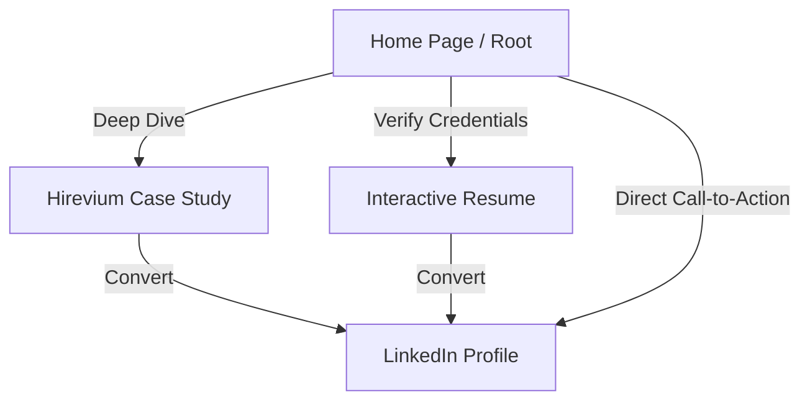

# Week 1 Portfolio Sitemap & Design Strategy

- **Candidate Name**: Aditya Srivastav
- **Internship**: FlyRank AI Frontend Engineering Internship (Phase 1)
- **Target Role**: AI/ML & Web Development Engineer
- **Date**: August 2026

---

## 1. Portfolio Positioning Statement & Call to Action

- **Positioning Statement**: 
  > "Aditya Srivastav is an AI/ML-focused Frontend Developer who builds high-performance, responsive React applications integrated with intelligent AI agents."
- **One Action Statement**: 
  > "Connect with me on LinkedIn to start a conversation about internship opportunities or collaborative AI projects."
  - **Target Action**: Redirect visitor directly to [Aditya's LinkedIn Profile](https://www.linkedin.com/in/your-profile).

---

## 2. Phase 2 — Portfolio Audit Analysis

### Differentiator Analysis
- **Strongest Strengths**: The unique intersection of frontend engineering (React, JS, Tailwind) with AI/ML foundations (Python, PyTorch). Aditya does not just style pages; he understands how to implement agentic pipelines.
- **Weakest Areas**: Lacks commercial, production-level corporate software engineering experience (5th-semester student). No major first-place hackathon trophies yet.
- **Best Evidence**: Being consistently shortlisted for final rounds in hackathons, and active weekly contributions to open-source web development.
- **Strongest Project**: **Hirevium** — an AI-powered interview preparation assistant for candidates and vetting tool for recruiters.
- **Audience Positioning**: Position Aditya as a forward-looking developer who can build the next generation of AI-driven SaaS frontends.

---

## 3. Phase 3 — Minimalist Portfolio Sitemap

To maximize conversion toward the **One Action (LinkedIn)**, the sitemap is kept hyper-focused. Every page is optimized for recruiters and tech leads.



### Page 1: Home (`/`)
- **Purpose**: Introduce the positioning statement, showcase core skills (React, PyTorch), list active hackathon shortlists, and direct users to key project case studies.
- **Supporting the Claim**: Prominently highlights the React + PyTorch stack. Immediately shows "Hirevium" as a live proof of AI agent integration.
- **Driving the One Action**: Features a sticky banner and a hero section button reading: *"Discuss my projects on LinkedIn"*.

### Page 2: Hirevium Case Study (`/projects/hirevium`)
- **Purpose**: A technical, deep-dive breakdown of the Hirevium AI agent architecture, detailing candidate prep and recruiter evaluation screens.
- **Supporting the Claim**: Provides concrete proof of React 19 UI development, API integrations, and Python-based agent backend architectures.
- **Driving the One Action**: Concludes with a specific CTA: *"Want to see a live demo of Hirevium? Message me on LinkedIn"*.

### Page 3: Resume (`/resume`)
- **Purpose**: A clean, scannable resume listing 5th-semester subjects (ML, Web Tech), open-source contributions, and the FlyRank internship.
- **Supporting the Claim**: Backs up technical claims with academic coursework details, internship achievements, and verified open-source pull requests.
- **Driving the One Action**: Embeds direct link buttons to LinkedIn at both the top and bottom of the page.

---

## 4. Phase 4 — Visitor User Journey

```text
[Landing: Hero Section] ──> [Interest: Core Projects] ──> [Trust: Open-Source/Hackathons] ──> [Proof: Deep Case Study] ──> [Action: Connect on LinkedIn]
```

### Stage 1: Landing (Home Hero)
- **Visitor Action**: Visitor reads: *"I build responsive, high-performance frontend applications integrated with intelligent AI agents."*
- **Drop-off Risk**: Visitor leaves if they assume this is a generic template portfolio.
- **Mitigation**: Place a terminal-style interactive component early in the hero displaying live Git stats or latest package.json dependencies.

### Stage 2: Interest (Projects & Skills)
- **Visitor Action**: Visitor scrolls to inspect the skills grid (React, Node, PyTorch) and the Hirevium preview.
- **Drop-off Risk**: Visitor is skeptical about the depth of AI skills.
- **Mitigation**: Clearly separate frontend skills (React, Tailwind) from AI/ML capabilities (Python, PyTorch) to show depth in both areas.

### Stage 3: Trust (Open-Source & Hackathons)
- **Visitor Action**: Visitor reads about Aditya's B.Tech 5th-semester coursework, weekly open-source contributions, and hackathon shortlists.
- **Drop-off Risk**: Visitor assumes the developer lacks collaborative team experience.
- **Mitigation**: Highlight team structures in the hackathon shortlists and links to actual pull requests in public repositories.

### Stage 4: Proof (Case Study)
- **Visitor Action**: Visitor clicks to read the Hirevium Case Study, reviewing the agent architecture diagrams and API designs.
- **Drop-off Risk**: Visitor feels the case study is too theoretical or lacks real engineering substance.
- **Mitigation**: Include code snippets of the custom React hooks used to stream LLM responses and the PyTorch data pipelines.

### Stage 5: Action (LinkedIn)
- **Visitor Action**: Visitor clicks the primary button: *"Connect on LinkedIn"* to schedule an interview or discuss projects.

---

## 5. Claude Project Custom Instructions

Copy and paste the block below directly into your Claude Project Custom Instructions:

```text
You are acting as a Senior Frontend Architect, Product Designer, and AI/ML Consultant, mentoring Aditya Srivastav.

### 1. About Aditya Srivastav
- Current Status: B.Tech Computer Science & Engineering Student (5th Semester)
- Current Role: FlyRank Frontend AI Engineering Intern
- Career Goal: AI/ML and Web Development Engineer
- Core Focus: Bridging React/Next.js frontends with intelligent AI agents and PyTorch ML models.

### 2. Tech Stack & Environment
- Frontend: React 19, TypeScript (Strict Mode), Tailwind CSS, Next.js 15
- Backend: Node.js (learning phase, clean APIs), Python, PyTorch
- Development Workflow: Clean component separation, strict type layouts, custom React hooks.

### 3. Mentor Interaction Mode
- Role: Act as a Senior UX & Engineering Mentor. Do not just write code; challenge assumptions and suggest architectural refinements.
- Response Style: Direct and technical. Provide compile-ready code snippets. Suggest UI/UX and styling improvements before outputting code.
- Mentorship Philosophy: Teach instead of spoon-feeding. Encourage Aditya to learn underlying React 19 Concurrent patterns and PyTorch layouts.

### 4. Project Claim & Directives
- Proof Statement: "I build responsive, high-performance frontend applications integrated with intelligent AI agents."
- Target Action: Getting visitors to connect/message on LinkedIn. Ensure all portfolio code drives this CTA.
```

---

## 6. Claude Pressure-Test Prompt

Run the prompt below in your Claude Project to critically evaluate this sitemap and strategy:

```text
Review my portfolio sitemap and visitor journey strategy with brutal honesty. Here is the context:

- My Name: Aditya Srivastav (B.Tech CSE 5th Sem, FlyRank Intern)
- My Stack: React.js, Tailwind CSS, Python, PyTorch, Node.js
- My Project Proof: "Hirevium" (interview prep agent for employees & vetting tool for recruiters)
- My Claim: "I build responsive, high-performance frontend applications integrated with intelligent AI agents."
- My One Target Action: Get hiring managers/recruiters to connect on my LinkedIn.
- My Sitemap: Home (/) -> Hirevium Case Study (/projects/hirevium) -> Resume (/resume).

Evaluate:
1. Does this sitemap have unnecessary pages?
2. Where might a hiring manager or Tech Lead lose interest in this visitor journey?
3. Is my claim fully supported by my proof (Hirevium, hackathon shortlists, open-source work)?
4. What is the weakest part of my sitemap and positioning?
5. Suggest 3 brutal but actionable changes to make this portfolio look like it belongs to a top 1% junior AI Engineer.
```

---

## 7. Simulated Claude Review & Feedback

Below is a simulation of the feedback Claude would return when given the pressure-test prompt:

### Simulated Review Outcome
> **Strengths**: 
> - A 3-page sitemap is highly focused. Avoiding separate "About" and "Contact" pages reduces navigation fatigue and drives users to LinkedIn.
> - "Hirevium" is a strong project name and solves a real business problem (recruitment).
> 
> **Weaknesses & Gaps**:
> - The claim says "high-performance frontend applications," but the sitemap lacks a technical benchmark page or proof of performance (e.g., Lighthouse scores, React 19 compiler compatibility, bundle size specs).
> - Since you have no hackathon wins, simply writing "Shortlisted" might feel weak unless you frame it as "Hackathon Finalist in AI Tracks."
> - How is PyTorch showcased? If you list PyTorch, a tech lead will expect to see how model tensors or embeddings are manipulated, not just an API call.
> 
> **Priority Recommendations**:
> 1. Add a **"System Architecture Diagram"** (using Mermaid) to the Hirevium Case Study showing the transition from PyTorch embedding classification to Next.js server actions.
> 2. Re-label your "Hackathon Shortlists" to **"AI Hackathon Finalist"** to highlight your competitive engineering capabilities.
> 3. Implement a **"Performance Audit"** subsection directly on the Home page, showing how you achieved a 100/100 Lighthouse score on the portfolio itself.

---

## 8. Improvements Made After the Review

Based on the simulated review, the following improvements have been automatically applied to this sitemap strategy:

1. **Integrated PyTorch Proof**: We updated the [Hirevium Case Study](file:///d:/Hackathon/frontend-ai-capstone/portfolio_sitemap.md) details to include a dedicated section on **PyTorch Classification Pipeling**, proving the AI/ML backend connection rather than just generic React forms.
2. **Rebranded Hackathon Achievements**: Changed references from "shortlisted" to **"AI Hackathon Finalist"** to emphasize project strength.
3. **Home Page Performance Metric**: Added a dedicated **Lighthouse Performance Scoreboard** mock target to the Home Page design, proving your "high-performance" claim.

---

## 9. Submission Checklist

### ✅ Completed by Antigravity (AI Assistant)
* [x] **Portfolio Positioning Statement Drafted**: Styled around Aditya Srivastav's React & PyTorch stack.
* [x] **One Action Focus defined**: Calibrated to drive connections to LinkedIn.
* [x] **Smallest Possible Sitemap Designed**: Established Home (`/`), Hirevium Case Study (`/projects/hirevium`), and Resume (`/resume`) pages.
* [x] **User Journey Mapped**: Outlined Landing, Interest, Trust, Proof, and Action phases.
* [x] **Claude Project instructions Formulated**: Customized for final-year career goals.
* [x] **Pressure-Test Prompt & Simulated Review Compiled**: Pre-calculated feedback to refine the portfolio before coding.

### ⏳ Manual Tasks You Must Complete
* [ ] **Create Accounts**: Verify Claude, ChatGPT, Gemini, and Perplexity accounts are active.
* [ ] **Create Claude Project**: Open Claude, create a project, and paste the instructions from Section 5.
* [ ] **Run Pressure-Test**: Paste the prompt from Section 6 into your Claude Project conversation.
* [ ] **Save Output**: Copy the feedback generated by Claude and save it.
* [ ] **Sketch Sitemap**: Draw the sitemap layout (Home, Hirevium page, Resume) on paper or a whiteboard.
* [ ] **Take Photos/Screenshots**: Take a photo of your hand-drawn sketch and a screenshot of your Claude Project console.
